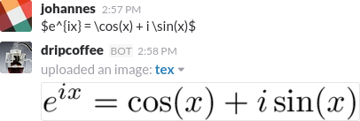

Slackbot that look for lines matching `$tex code$` and upload images.



## Install on heroku

#### Create a slack bot
https://api.slack.com/bot-users


#### Setup heroku

https://devcenter.heroku.com/articles/getting-started-with-nodejs


#### Create the app and add buildpacks

```sh
heroku create --buildpack heroku/nodejs
heroku buildpacks:add https://github.com/Thermondo/heroku-buildpack-tex
```

#### Set slack token

```sh
heroku config:set SLACK_TOKEN=<Your secret token>
```

#### Initialize the bot

```sh
git push heroku master
```

#### Invite the bot

`/invite <your bot name>`

#### Test the bot
In the channel type:

```
$e^{ix} = \cos(x) + i \sin(x)$
```
